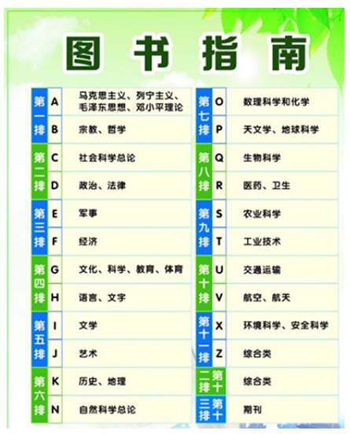

# 课前了解
   - 计算机组成 
     - cpu跟内存作用
     - 计算机组成应该包含什么，日常生活能见到
听到的，两到三个。
- ### cpu作用:中央处理器，处理指令（例如按下鼠标需要cpu处理）
或者某些运算数据（计算1+1）
- ### 内存作用:存储cpu要处理的数据，是临时存储数据的地方。
  - 是否所有数据都存在内存里(cpu要处理数据放入内存当中，例如有个数据需要cpu运算，
    cpu优先把硬盘中数据调取到内存中，这时候cpu处理的是内存当中数据，数据处理好
    后再次存入硬盘当中，为的是提高处理效率)
    - 举例：网吧上网，设备老旧用着很卡，找网管，网管如何回答，网管让重启下，
重启是因为cpu频繁调用内存数据，导致计算机卡顿，重启后释放临时存储的数据。
学习内存作用有利于消化后面知识点。

计算机组成


# 目标

- 了解Python
- Python的应用领域
- Python的版本

# Python介绍

Python是时下最流行、最火爆的编程语言之一，具体原因如下：

1. 简单、易学，适应人群广泛
    - 简单 
      - 你可能已经听说过很多种流行的编程语言，比如非常难学的C语言，非常流行的Java语言，适合初学者的Basic语言，适合网页编程的Java语言等，Python是他们其中的一种。而不同的编程语言，干同一件事，编写的代码量，差距也很大。比如完成同一个任务，C语言要写1000行代码，Java只需要写100行，而Python可能只要20行。

    
 
    


2. 免费、开源
  - 开源:开放源代码，直接看到底层源代码供我们去学习，程序员觉得
    当前版本，小问题语法不够简单，可以给研发团队发邮件，万一意见建议已经可行，python下一个版本及有可能添加我们版本跟意见，全球程序员都有机会一块维护python，将来会越来越好，这里就是开源的意思.


3. 应用领域广泛
  
  很多著名的网站像知乎、YouTube就是Python写的;可以做网络游戏的后台，很多在线游戏的后台都是Python开发的。

  课程是web开发（web开发常用框架有django跟flask）
   - 按前后端分，python是后端语言。
   - 什么是前后端？
     - 前端：你通过设备能看到的东西，例如软件，网页
     - 后端: 专门为前端提供数据的一套软件


> 备注：以下知名框架均是Python语言开发。

- Google开源机器学习框架：TensorFlow
- 开源社区主推学习框架：Scikit-learn
- 百度开源深度学习框架：Paddle

> Python发展历史：https://baike.baidu.com/item/Python/407313?fr=aladdin
  (今生前世)

# Python版本

- Python 2.X
- Python 3.X
  - Python 3.5
  - Python 3.6
  - Python 3.7 

> 注意：课程讲解3.7。

# 总结

- Python优点：
  - 学习成本低
  - 开源
  - 适应人群广泛
  - 应用领域广泛
- Python学习版本：3.7
   版本要求:版本根据公司需求而定，新版本问题多不易于开发，


⽬标
解释器的作⽤
下载Python解释器
安装Python解释器
⼀. 解释器的作⽤
- Python解释器作⽤：运⾏python⽂件
  -  举例a 跟b两人语言不通 还想交流怎么办
    请翻译官，程序员写python需要计算机执行
    a是程序员，计算机能读懂吗？计算机世界
    只有0和1，0表示电路关，1表示电路开，
    翻译运行代码。解释器翻译代码给计算机。
- Python解释器种类
  - CPython，C语言开发的解释器[官方]，应用广泛的解释器。
  - IPython，基于CPython的一种交互式解释器。
  - 其他解释器
    - PyPy，基于Python语言开发的解释器。
    - Jython，运行在Java平台的解释器，直接把Python代码编译成Java字节码执行。
    - IronPython，运行在微软.Net平台上的Python解释器，可以直接把Python代码编译成.Net的字节码。

> 课程中使用的解释器：CPython

### 学习路线


## 基础课程简介
- 编程语言其实就是处理数据，第一大部分对于学习数据序列比较重要，重要
  同时比较痛苦，涉及大量单词需要掌握不是记忆，具体学习方法讲到
  对应知识点会强调，第二大部分包含函数和文件操作，函数是非常重要知识点
  关于函数递归还会稍微有点抽象，学完函数，文件操作读读取写入。
  第三大块文件操作，面向对象（很重要）和模块（帮助我们化解工作量）异常是
  帮助我们解决问题用的，最后会有综合实战，综合实战作用是什么？（综合运用之前所学知识点做项目，能体会项目开发流程，还能巩固消化之前知识点，还可以对之前
  知识点进行查漏补缺）。学习过程由简单到难。


⼆. 下载Python解释器
下载地址：https://www.python.org/downloads/release/python-372/
[单击上述链接] -- 查找⽬标⽂件：Windows x86-64 executable installer -- 单击即可下载


安装Python解释器

双击可执行文件 — 勾选[pip] -- [Next] -- [勾选添加环境变量] -- [Install]，按提示操作即可。


# 总结
- 解释器的作⽤：运⾏python⽂件
- 解释器环境：先下载后安装


# 课程：PyCharm

# 课程目标

- PyCharm的作用
- 下载安装PyCharm
- PyCharm的基本使用
- PyCharm的基本设置

# 一. PyCharm的作用

PyCharm是一种Python ==IDE==（集成开发环境,写pyhton代码用的，类似于excel，word），带有一整套可以帮助用户在使用Python语言开发时==提高其效率的工具==，内部集成的功能如下：

- Project管理
- 智能提示
- 语法高亮
- 代码跳转
- 调试代码
- 解释代码(解释器)
- 框架和库
- ......

> PythonCharm分为专业版（professional）和社区版（community）
 - 专业版本收费，基础语法知识点没必要用专业版，集成专业语法
跟库用不上。

# 二. 下载和安装(见安装文档)

## 2.1 下载

下载地址：http://www.jetbrains.com/pycharm/download/#section=windows


> 注意：这里选择专业破解版下载，专业版是收费版本，
- 下载破解版见文档。


## 2.2 安装

双击安装包 -- [运行] -- [允许你应用更改设备]: [是] -- [Next] -- [选择安装位置] -- [Next] -- [Install] -- [Finish]。


# 三. PyCharm基本使用

## 3.1 新建项目

打开PyCharm -- [Create New Project] -- 选择项目根目录和解释器版本 -- [Create]，即可完成新建一个项目。
-  创建新项目会自动生成main.py文件，main.py文件是pycharm中新建项目时自动生成的一个文件，它的作用是用来作为程序的入口，也就是说，当你运行程序时，首先会执行main.py文件中的代码


## 3.2 新建文件并书写代码

项目根目录或根目录内部任意位置 — 右键 -- [New] -- [Python File] -- 输入文件名 -- [OK]

> 如果是将来要上传到服务器的文件，那么文件名切记不能用中文。


双击打开文件，并书写一个最简单的Python代码：

``` python
print("hello world")
```


## 3.3 运行文件

文件打开状态 -- 空白位置 — 右键 -- Run -- 即可调出Pycharm的控制台输出程序结果。


# 四. PyCharm的基本设置

[file] -- [Settings]/[Default Settings]。


## 4.1 修改主题

[Appearance & Behavior] -- [Appearance]


- Theme：修改主题
- Name：修改主题字体
- Size：修改主题字号

## 4.2 修改代码文字格式

[Editor] -- [Font]

- Font：修改字体
- Size：修改字号
- Line Spacing：修改行间距

## 4.3 修改解释器

[Project: 项目名称] -- [Project Interpreter] -- [设置图标] -- [Add] -- 浏览到目标解释器 -- [OK] -- [OK]。

## 4.4 项目管理

### 4.4.1 打开项目

[File] -- [Open] -- 浏览选择目标项目根目录 -- [OK] -- 选择打开项目方式。

打开项目的方式共三种，分别如下：


1. This Window 

覆盖当前项目，从而打开目标项目

2. New Window

在新窗口打开，则打开两次PyCharm，每个PyCharm负责一个项目。


3. Attach


### 4.4.2 关闭项目

[File] -- [Close Project]/[Close Projects in current window]

# 总结

- PyCharm新建文件

项目管理空白位置 — 右键 -- New -- PythonFile

- 运行文件

代码内部 — 右键 -- Run

- 修改代码文字格式

[file] -- [Settings]/[Default Settings] -- [Editor] -- [Font]


# 目标

- 注释的作用
- 注释的分类及语法
- 注释的特点

# 一. 注释的作用

- 没有注释的代码


- 添加注释的代码


> - 通过用自己熟悉的语言，在程序中对某些代码进行标注说明，这就是注释的作用，能够大大增强程序的可读性。

# 二. 注释的分类及语法

注释分为两类：==单行注释== 和 ==多行注释==。

- 单行注释

只能注释一行内容，语法如下：

```python
# 注释内容
```

- 多行注释

可以注释多行内容，一般用在注释一段代码的情况， 语法如下：

```python
"""
	第一行注释
	第二行注释
	第三行注释
"""

'''
	注释1
	注释2
	注释3
'''
```

> 快捷键： ==ctrl + /==

## 2.1 快速体验

- 单行注释

``` python
# 输出hello world
print('hello world')

print('hello Python')  # 输出(简单的说明可以放到一行代码的后面，一般习惯代码后面添加两个空格再书写注释文字)
```

- 多行注释

``` python
"""
    下面三行都是输出的作用，输出内容分别是：
    hello Python
    hello it
    hello itworld
"""
print('hello Python')
print('hello it')
print('hello itworld')


'''
    下面三行都是输出的作用，输出内容分别是：
    hello Python
    hello it
    hello itworld
'''
print('hello Python')
print('hello it')
print('hello itworld')
```

> 注意：解释器不执行任何的注释内容。

# 总结

- 注释的作用

用人类熟悉的语言对代码进行解释说明，方便后期维护。

- 注释的分类
  - 单行： `# 注释内容`，快捷键ctrl+/
  - 多行：`""" 注释内容 """` 或 `''' 注释内容 '''`
- 解释器不执行注释内容


# 目标

- 变量的作用
- 定义变量
- 认识数据类型


# 一.  变量的作用



举例体验：我们去图书馆读书，怎么样快速找到自己想要的书籍呢？是不是管理员提前将书放到固定位置，并把这个位置进行了编号，我们只需要在图书馆中按照这个编号查找指定的位置就能找到想要的书籍。

这个编号其实就是把书籍存放的书架位置起了一个名字，方便后期查找和使用。

程序中，数据都是临时存储在内存中，为了更快速的查找或使用这个数据，通常我们把这个数据在内存中存储之后定义一个名称，这个名称就是变量。


> 变量就是一个存储数据的的时候当前数据所在的内存地址的名字而已。

# 二.  定义变量

```python
变量名 = 值
```

> 变量名自定义，要满足==标识符==命名规则。

## 2.1  标识符

标识符命名规则是Python中定义各种名字的时候的统一规范，具体如下：

- 由数字、字母、下划线组成
- 不能数字开头
- 不能使用内置关键字
- 严格区分大小写

```html
False     None    True   and      as       assert   break     class  
continue  def     del    elif     else     except   finally   for
from      global  if     import   in       is       lambda    nonlocal
not       or      pass   raise    return   try      while     with  
yield
```


## 2.2 命名习惯


- 见名知义。
- 大驼峰：即每个单词首字母都大写，例如：`MyName`。
- 小驼峰：第二个（含）以后的单词首字母大写，例如：`myName`。
- 下划线：例如：`my_name`。

## 2.3 使用变量

``` python
my_name = 'TOM'
print(my_name)

schoolName = '糕雪森程序员'
print(schoolName)
```

## 2.4 认识bug

所谓bug，就是程序中的错误。如果程序有错误，需要程序员排查问题，纠正错误。


# 三. Debug工具

Debug工具是PyCharm IDE中集成的用来调试程序的工具，在这里程序员可以查看程序的执行细节和流程或者调解bug。

Debug工具使用步骤：

1. 打断点
2. Debug调试

## 3.1 打断点

- 断点位置

目标要调试的代码块的第一行代码即可，即一个断点即可。

- 打断点的方法

单击目标代码的行号右侧空白位置。


## 3.2 Debug调试

打成功断点后，在文件内部任意位置 — 右键 -- Debug'文件名' — 即可调出Debug工具面板 -- 单击Step Over/shift+F8，即可按步执行代码。


### 3.2.1 Debug输出面板分类

- Debugger
  - 显示变量和变量的细节
- Console
  - 输出内容


# 四. 认识数据类型

**在 Python 里为了应对不同的业务需求，也把数据分为不同的类型。**


> 检测数据类型的方法：`type()`

```python
a = 1
print(type(a))  # <class 'int'> -- 整型

b = 1.1
print(type(b))  # <class 'float'> -- 浮点型

c = True
print(type(c))  # <class 'bool'> -- 布尔型

d = '12345'
print(type(d))  # <class 'str'> -- 字符串
"""
列表：
任意对象的有序集合 
列表是一组任意类型的值，按照一定顺序组合而成的 
"""
e = [10, 20, 30]
print(type(e))  # <class 'list'> -- 列表
"""
元组
任意对象的有序集合 
与列表相同,属于属于不可变序列类型 
类似于字符串，但元组是不可变的，不支持在列表中任何原处修改操作，不支持任何方法调用  
"""
f = (10, 20, 30)
print(type(f))  # <class 'tuple'> -- 元组
"""
是一组key的集合，但不存储value，并且key不能重复 
"""
h = {10, 20, 30}
print(type(h))  # <class 'set'> -- 集合
"""
# 字典
1.通过键而不是偏移量来读取 
字典就是一个关联数组，是一个通过关键字索引的对象的集合，使用键-值（key-value）进行存储，查找速度快 
2.任意对象的无序集合 
字典中的项没有特定顺序，以“键”为象征 
"""
g = {'name': 'TOM', 'age': 20}
print(type(g))  # <class 'dict'> -- 字典
```

# 总结

- 定义变量的语法

``` python
变量名 = 值
```

- 标识符
  - 由数字、字母、下划线组成
  - 不能数字开头
  - 不能使用内置关键字
  - 严格区分大小写
- 数据类型
  - 整型：int
  - 浮点型：float
  - 字符串：str
  - 布尔型：bool
  - 元组：tuple
  - 集合：set
  - 字典：dict
