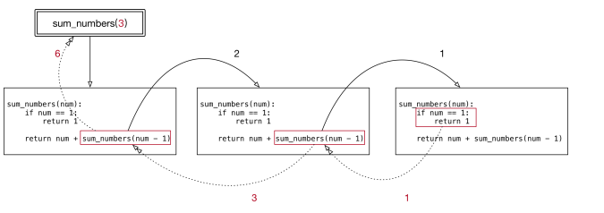

# 课程：函数加强

# 目标

- 递归
- lambda 表达式


# 一. 递归

## 1.1 递归的应用场景

递归是一种编程思想，应用场景：

1. 在我们日常开发中，如果要遍历一个文件夹下面所有的文件，通常会使用递归来实现；
2. 在后续的算法课程中，很多算法都离不开递归，例如：快速排序。

### 1.1.1 递归的特点

- 函数内部自己调用自己
- 必须有出口


## 1.2 应用：3以内数字累加和

- 代码
```
在Python中，函数的返回值是通过return语句返回(返回函数调用的位置）的。return语句用于退出函数并将结果返回给调用方。函数可以返回任何数据类型，包括整数、字符串、列表、元组、字典等。如果函数没有明确使用return语句，则默认返回None
def re_mount():
    pass
    return

s=re_mount()
print(s)
```

```python

#需求：3以内数字累加和 3+2+1=6
# 6=3+2以内数字累加和
# 2以内数字累加和=2+1以内数字累加和（表达式）
#1以内数字累加和=1（表达式）出口
# 一步一步往上返回上次调用的地方

# 递归特点 自己调自己否则进入近乎进入死循环（提示超过最大递归深度:函数自己调用字的次数，取决于计算机配置）


# 3 + 2 + 1 了解计算机执行逻辑
def sum_numbers(num):
    # 1.如果是1，直接返回1 -- 出口
    if num == 1:
        return 1
    # 2.如果不是1，重复执行累加并返回结果
    return num + sum_numbers(num-1)


sum_result = sum_numbers(3)
# 输出结果为6
print(sum_result)
```

- 执行结果



# 二. lambda 表达式

## 2.1 lambda的应用场景

如果一个函数有一个返回值，并且只有一句代码，可以使用 lambda简化。(内存执行函数的空间要大于lambda的空间，对于程序员简化代码，对于电脑服务器节省内存开销)


## 2.2 lambda语法

```python
lambda 参数列表 ： 表达式
```

> 注意

- lambda表达式的参数可有可无，函数的参数在lambda表达式中完全适用。
- lambda表达式能接收任何数量的参数但只能返回一个表达式的值。

### 快速入门

```python
# 函数
def fn1():
    return 200


print(fn1)
print(fn1())


# lambda表达式（匿名表达式）
fn2 = lambda: 100
print(fn2)
print(fn2())
```

> 注意：直接打印lambda表达式，输出的是此lambda的内存地址


## 2.3 示例：计算a + b

### 2.3.1 函数实现

```python
def add(a, b):
    return a + b

# 函数调用赋值变量，执行return代码返回位置就是函数调用的位置，函数调用赋值变量并打印
result = add(1, 2)
print(result)
```

> 思考：需求简单，是否代码多？

### 2.3.2 lambda实现

```python
fn1 = lambda a, b: a + b
print(fn1(1, 2))
```


## 2.4 lambda的参数形式

### 2.4.1.无参数

```python
fn1 = lambda: 100
print(fn1())
```

### 2.4.2.一个参数

```python
fn1 = lambda a: a
print(fn1('hello world'))
```

### 2.4.3.默认参数

```python
fn1 = lambda a, b, c=100: a + b + c
print(fn1(10, 20))
```

### 2.4.4.可变参数：*args（收集不定长位置参数）

```python
fn1 = lambda *args: args
print(fn1(10, 20, 30))
```

> 注意：这里的可变参数传入到lambda之后，返回值为元组。

### 2.4.5.可变参数：**kwargs（收集不定长关键字参数)

```python
fn1 = lambda **kwargs: kwargs
print(fn1(name='python', age=20))
```


## 2.5 lambda的应用

### 2.5.1. 带判断的lambda

```python
fn1 = lambda a, b: a if a > b else b
print(fn1(1000, 500))
```

### 2.5.2. 列表数据按字典key的值排序

```python
students = [
    {'name': 'TOM', 'age': 20},
    {'name': 'ROSE', 'age': 19},
    {'name': 'Jack', 'age': 22}
]

# 按name值升序排列
students.sort(key=lambda x: x['name'])
print(students)

# 按name值降序排列
students.sort(key=lambda x: x['name'], reverse=True)
print(students)

# 按age值升序排列
students.sort(key=lambda x: x['age'])
print(students)
# 课程练习题
```
items = []


def add_item( name, price, quantity):
    items.append({"name": name, "price": price, "quantity": quantity})
def display_cart():
    if not items:
        print("购物车为空")
    else:
        print("购物车内容：")
        for item in items:
            print(f"商品名称: {item['name']}, 价格: {item['price']}, 数量: {item['quantity']}")
def modify_item(index, name=None, price=None, quantity=None):
    if index < 0 or index >= len(items):
        print("无效的索引")
        return
    item = items[index]
    if name:
        item['name'] = name
    if price:
        item['price'] = price
    if quantity:
        item['quantity'] = quantity
def calculate_total_price():
    total_price = 0
    for item in items:
        total_price += item['price'] * item['quantity']
    return total_price


while True:
    print("\n请选择操作：")
    print("1. 添加商品")
    print("2. 展示购物车")
    print("3. 修改购物车信息")
    print("4. 计算总价")
    print("5. 退出")
    choice = input("输入数字以选择操作：")
    if choice == "1":
        name = input("输入商品名称：")
        price = float(input("输入商品价格："))
        quantity = int(input("输入商品数量："))
        add_item(name, price, quantity)
    elif choice == "2":
        display_cart()
    elif choice == "3":
        index = int(input("输入要修改的商品索引："))
        name = input("输入新的商品名称（按回车跳过）：")
        price = float(input("输入新的商品价格（按回车跳过）：") or -1)
        quantity = int(input("输入新的商品数量（按回车跳过）：") or -1)
        modify_item(index, name, price if price != -1 else None, quantity if quantity != -1 else None)
    elif choice == "4":
        print(f"总价为: {calculate_total_price()}")
    elif choice == "5":
        print("感谢使用，再见！")
        break
    else:
        print("无效的选项，请重新输入。")
```


# 三. 总结

- 递归

  - 函数内部自己调用自己
  - 必须有出口

- lambda

  - 语法

  ``` python
  lambda 参数列表: 表达式
  ```

  - lambda的参数形式

    - 无参数

    ``` python
    lambda: 表达式
    ```

    - 一个参数

    ``` python
    lambda 参数: 表达式
    ```

    - 默认参数

    ``` python
    lambda key=value: 表达式
    ```

    - 不定长位置参数

    ``` python
    lambda *args: 表达式
    ```

    - 不定长关键字参数

    ``` python
    lambda **kwargs: 表达式
    ```
