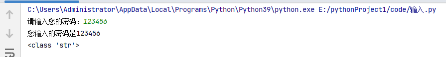
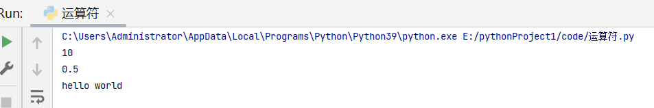
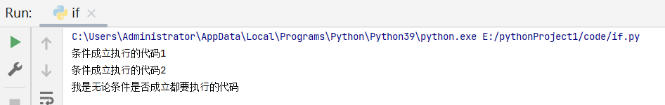

# 目标

- 格式化输出(输出一种带格式的数据给用户)
  - 格式化符号
  - f-字符串
- print的结束符


# 输出

作用：程序输出内容给用户

```python
print('hello Python')
#这种 用户不能确定18是年纪还是年份
age = 18

print(age)

# 需求：输出“今年我的年龄是18岁”（这种是格式化输出）
```

# 一.  格式化输出

所谓的格式化输出即按照一定的格式输出内容。

### 1.1 格式化符号
重点是前3个，后面只需要了解

| 格式符号 |          转换          |
| :------: | :--------------------: |
|  ==%s==  |         字符串         |
|  ==%d==  |   有符号的十进制整数 (有符号的整数包含负整数跟正整数，无符号只能格式化正整数)  | 
|  ==%f==  |         浮点数         | 
|    %c    |          字符          |
|    %u    |    无符号十进制整数    |
|    %o    |       八进制整数       |
|    %x    | 十六进制整数（小写ox） |
|    %X    | 十六进制整数（大写OX） |
|    %e    | 科学计数法（小写'e'）  |
|    %E    | 科学计数法（大写'E'）  |
|    %g    |      %f和%e的简写      |
|    %G    |      %f和%E的简写      |

> 技巧

- %06d，表示输出的整数显示位数，不足以0补全，超出当前位数则原样输出
- %.2f，表示小数点后显示的小数位数。

### 1.2 体验

格式化字符串除了%s，还可以写为`f'{表达式}'`

```python
age = 18 
name = 'TOM'
weight = 75.5
student_id = 1

# 我的名字是TOM
print('我的名字是%s' % name)

# 我的学号是0001
print('我的学号是%04d' % student_id)

# 我的体重是75.50公斤
print('我的体重是%.2f公斤' % weight)

# 我的名字是TOM，今年18岁了
print('我的名字是%s，今年%d岁了' % (name, age))

# 我的名字是TOM，明年19岁了
print('我的名字是%s，明年%d岁了' % (name, age + 1))

# 我的名字是TOM，明年19岁了
print(f'我的名字是{name}, 明年{age + 1}岁了')
```

> f-格式化字符串是Python3.6中新增的格式化方法，该方法更简单易读。

### 1.3 转义字符

- `\n`：换行。
- `\t`：制表符，一个tab键（4个空格）的距离。

### 1.4 结束符

> 想一想，为什么两个print会换行输出？

```python
print('输出的内容', end="\n")
```

> 在Python中，print()， 默认自带`end="\n"`这个换行结束符，所以导致每两个`print`直接会换行展示，用户可以按需求更改结束符。

# 总结

- 格式化符号
  - %s：格式化输出字符串
  - %d：格式化输出整数
  - %f：格式化输出浮点数
- f-字符串
  - f'{表达式}'
- 转义字符
  - \n：换行
  - \t：制表符
- print结束符

``` python
print('内容', end="")
```


# 目标

- 输入功能的语法
- 输入input的特点

# 一. 输入

在Python中，程序接收用户输入的数据的功能即是输入。


## 1.2 输入的语法

```python
input("提示信息")
```

## 1.3 输入的特点

- 当程序执行到`input`，等待用户输入，输入完成之后才继续向下执行。
- 在Python中，`input`接收用户输入后，一般存储到变量，方便使用。
- 在Python中，`input`会把接收到的任意用户输入的数据都当做字符串处理。

```python
password = input('请输入您的密码：')

print(f'您输入的密码是{password}')
# <class 'str'> 数据类型是字符串
print(type(password))
```

控制台输出结果如下：



# 总结

- 输入功能
  - input('提示文字')
- 输入的特点
  - 一般将input接收的数据存储到变量
  - input接收的任何数据默认都是字符串数据类型


# 目标

- 数据类型转换的必要性
- 数据类型转换常用方法

# 一. 转换数据类型的作用

问：input()接收用户输入的数据都是字符串类型，如果用户输入1，想得到整型该如何操作？

答：转换数据类型即可，即将字符串类型转换成整型。

既然转换类型如此重要我们应当如何转换？采用数据准换类型函数。
# 二. 转换数据类型的函数

|          函数          |                        说明                         |
| :--------------------: | :-------------------------------------------------: |
|  ==int(x [,base ])==   |                  将x转换为一个整数                  |
|     ==float(x )==      |                 将x转换为一个浮点数                 |
| complex(real [,imag ]) |        创建一个复数，real为实部，imag为虚部         |
|      ==str(x )==       |                将对象 x 转换为字符串                |
|        repr(x )        |             将对象 x 转换为表达式字符串             |
|     ==eval(str )==     | 用来计算在字符串中的有效Python表达式,并返回一个对象 |
|     ==tuple(s )==      |               将序列 s 转换为一个元组               |
|      ==list(s )==      |               将序列 s 转换为一个列表               |
|        chr(x )         |           将一个整数转换为一个Unicode(字符编码标准)字符           |
|        ord(x )         |           将一个字符转换为它的ASCII(美国信息交换标准代码)整数值           |
|        hex(x )         |         将一个整数转换为一个十六进制字符串          |
|        oct(x )         |          将一个整数转换为一个八进制字符串           |
|        bin(x )         |          将一个整数转换为一个二进制字符串           |

# 三. 快速体验


``` python
# 1. 接收用户输入
num = input('请输入您的幸运数字：')

# 2. 打印结果
print(f"您的幸运数字是{num}")


# 3. 检测接收到的用户输入的数据类型 -- str类型
print(type(num))

# 4. 转换数据类型为整型 -- int类型
print(type(int(num)))
```

# 四. 实验

``` python
# 1. float() -- 转换成浮点型
num1 = 1
print(float(num1))
print(type(float(num1)))

# 2. str() -- 转换成字符串类型
num2 = 10
print(type(str(num2)))

# 3. tuple() -- 将一个列表转成元组
list1 = [10, 20, 30]
print(tuple(list1))
print(type(tuple(list1)))


# 4. list() -- 将一个元组序列转换成列表
t1 = (100, 200, 300)
print(list(t1))
print(type(list(t1)))

# 5. eval() -- 将字符串中的数据转换成Python表达式原本类型
str1 = '10'
str2 = '[1, 2, 3]'
str3 = '(1000, 2000, 3000)'
print(type(eval(str1)))
print(type(eval(str2)))
print(type(eval(str3)))
```

# 总结

- 转换数据类型常用的函数
  - int()
  - float()
  - str()
  - list()
  - tuple()
  - eval()


  # 目标

掌握常用运算符的作用

# 运算符的分类

- 算数运算符
- 赋值运算符
- 复合赋值运算符
- 比较运算符
- 逻辑运算符

## 1. 算数运算符

| 运算符 |  描述  | 实例                                                  |
| :----: | :----: | ----------------------------------------------------- |
|   +    |   加   | 1 + 1 输出结果为 2                                    |
|   -    |   减   | 1-1 输出结果为 0                                      |
|   *    |   乘   | 2 * 2 输出结果为 4                                    |
|   /    |   除   | 10 / 2 输出结果为 5                                   |
|   //   |  整除  | 9 // 4 输出结果为2                                    |
|   %    |  取余  | 9 % 4 输出结果为 1                                    |
|   **   |  指数  | 2 ** 4 输出结果为 16，即 2 * 2 * 2 * 2                |
|   ()   | 小括号 | 小括号用来提高运算优先级，即 (1 + 2) * 3 输出结果为 9 |

> 注意：

- 混合运算优先级顺序：`()`高于 `**` 高于 `*` `/` `//` `%` 高于 `+` `-`

## 2. 赋值运算符

| 运算符 | 描述 | 实例                                |
| ------ | ---- | ----------------------------------- |
| =      | 赋值 | 将`=`右侧的结果赋值给等号左侧的变量 |

- 单个变量赋值

```python
num = 1
print(num)
```

- 多个变量赋值

```python
num1, float1, str1 = 10, 0.5, 'hello world'
print(num1)
print(float1)
print(str1)
```

结果如下：



- 多变量赋相同值（考虑数据的情况下）

```python
a = b = 10
print(a)
print(b)
```

结果如下：


## 3. 复合赋值运算符 

| 运算符 | 描述           | 实例                       |
| ------ | -------------- | -------------------------- |
| +=     | 加法赋值运算符 | c += a 等价于 c = c + a    |
| -=     | 减法赋值运算符 | c -= a 等价于 c = c- a     |
| *=     | 乘法赋值运算符 | c *= a 等价于 c = c * a    |
| /=     | 除法赋值运算符 | c /= a 等价于 c = c / a    |
| //=    | 整除赋值运算符 | c //= a 等价于 c = c // a  |
| %=     | 取余赋值运算符 | c %= a 等价于 c = c % a    |
| **=    | 幂赋值运算符   | c ** = a 等价于 c = c ** a |

```python
a = 100
a += 1
# 输出101  a = a + 1,最终a = 100 + 1
print(a)

b = 2
b *= 3
# 输出6  b = b * 3,最终b = 2 * 3
print(b)

c = 10
c += 1 + 2
# 输出13, 先算运算符右侧1 + 2 = 3， c += 3 , 推导出c = 10 + 3
print(c)
```


## 4. 比较运算符

比较运算符也叫关系运算符， 通常用来判断。

| 运算符 | 描述                                                         | 实例                                                        |
| ------ | ------------------------------------------------------------ | ----------------------------------------------------------- |
| ==     | 判断相等。如果两个操作数的结果相等，则条件结果为真(True)，否则条件结果为假(False) | 如a=3,b=3，则（a == b) 为 True                              |
| !=     | 不等于 。如果两个操作数的结果不相等，则条件为真(True)，否则条件结果为假(False) | 如a=3,b=3，则（a == b) 为 True如a=1,b=3，则(a != b) 为 True |
| >      | 运算符左侧操作数结果是否大于右侧操作数结果，如果大于，则条件为真，否则为假 | 如a=7,b=3，则(a > b) 为 True                                |
| <      | 运算符左侧操作数结果是否小于右侧操作数结果，如果小于，则条件为真，否则为假 | 如a=7,b=3，则(a < b) 为 False                               |
| >=     | 运算符左侧操作数结果是否大于等于右侧操作数结果，如果大于，则条件为真，否则为假 | 如a=7,b=3，则(a < b) 为 False如a=3,b=3，则(a >= b) 为 True  |
| <=     | 运算符左侧操作数结果是否小于等于右侧操作数结果，如果小于，则条件为真，否则为假 | 如a=3,b=3，则(a <= b) 为 True                               |

```python
a = 7
b = 5
print(a == b)  # False
print(a != b)  # True
print(a < b)   # False
print(a > b)   # True
print(a <= b)  # False
print(a >= b)  # True
```

## 5. 逻辑运算符

| 运算符 | 逻辑表达式 | 描述                                                         | 实例                                     |
| ------ | ---------- | ------------------------------------------------------------ | ---------------------------------------- |
| and    | x and y    | 布尔"与"：如果 x 为 False，x and y 返回 False，否则它返回 y 的值。 | True and False， 返回 False。            |
| or     | x or y     | 布尔"或"：如果 x 是 True，它返回 True，否则它返回 y 的值。   | False or True， 返回 True。              |
| not    | not x      | 布尔"非"：如果 x 为 True，返回 False 。如果 x 为 False，它返回 True。 | not True 返回 False, not False 返回 True |

```python
a = 1
b = 2
c = 3
print((a < b) and (b < c))  # True
print((a > b) and (b < c))  # False
print((a > b) or (b < c))   # True
print(not (a > b))          # True
```

### 5.1 拓展

数字之间的逻辑运算

``` python
a = 0
b = 1
c = 2

# and运算符，只要有一个值为0，则结果为0，否则结果为最后一个非0数字
print(a and b)  # 0
print(b and a)  # 0
print(a and c)  # 0
print(c and a)  # 0
print(b and c)  # 2
print(c and b)  # 1

# or运算符，只有所有值为0结果才为0，否则结果为第一个非0数字
print(a or b)  # 1
print(a or c)  # 2
print(b or c)  # 1
```

# 总结

- 算数运算的优先级
  - 混合运算优先级顺序：`()`高于 `**` 高于 `*` `/` `//` `%` 高于 `+` `-`
- 赋值运算符
  - =
- 复合赋值运算符
  - +=
  - -=
  - 优先级
    1. 先算复合赋值运算符右侧的表达式
    2. 再算复合赋值运算的算数运算
    3. 最后算赋值运算
- 比较运算符
  - 判断相等： == 
  - 大于等于： >=
  - 小于等于：<=
  - 不等于： !=
- 逻辑运算符
  - 与： and
  - 或：or
  - 非：not


  
  # 目标

- 条件语句作用
- if语法
- if...else...
- 多重判断
- if嵌套

# 一. 了解条件语句

假设一个场景：

- 同学们这个年龄去过网吧吗？
- 去网吧进门想要上网必须做的一件事是做什么？（考虑重点）
- 为什么要把身份证给工作人员？
- 是不是就是为了判断是否成年？
- 是不是如果成年可以上网？如果不成年则不允许上网？

其实这里所谓的判断就是条件语句，即**条件成立执行某些代码，条件不成立则不执行这些代码**。

# 二. if 语法

## 2.1 语法

``` python
if 条件:
    条件成立执行的代码1
    条件成立执行的代码2
    ......
```


## 2.2 快速体验

``` python
if True:
    print('条件成立执行的代码1')
    print('条件成立执行的代码2')

# 下方的代码没有缩进到if语句块，所以和if条件无关
print('我是无论条件是否成立都要执行的代码')
```

执行结果如下：




# 三. 实例：上网

需求分析：如果用户年龄大于等于18岁，即成年，输出"已经成年，可以上网"。

## 3.1 简单版

``` python
age = 20
if age >= 18:
    print('已经成年，可以上网')

print('系统关闭')
```

## 3.2 进阶版

新增需求：用户可以输出自己的年龄，然后系统进行判断是否成年，成年则输出"您的年龄是'用户输入的年龄'，已经成年，可以上网"。

``` python
# input接受用户输入的数据是字符串类型，条件是age和整型18做判断，所以这里要int转换数据类型
age = int(input('请输入您的年龄：'))

if age >= 18:
    print(f'您的年龄是{age},已经成年，可以上网')


print('系统关闭')
```


# 四. if...else...

作用：条件成立执行if下方的代码; 条件不成立执行else下方的代码。

> 思考：网吧上网的实例，如果成年，允许上网，如果不成年呢？是不是应该回复用户不能上网？

## 4.1 语法

``` python
if 条件:
    条件成立执行的代码1
    条件成立执行的代码2
    ......
else:
    条件不成立执行的代码1
    条件不成立执行的代码2
    ......
```

## 4.2 实用版：网吧上网

``` python
age = int(input('请输入您的年龄：'))

if age >= 18:
    print(f'您的年龄是{age},已经成年，可以上网')
else:
    print(f'您的年龄是{age},未成年，请自行回家写作业')

print('系统关闭')
```

> 注意：如果条件成立执行了某些代码，那么其他的情况的代码将不会执行。

# 五、多重判断

> 思考：中国合法工作年龄为18-60岁，即如果年龄小于18的情况为童工，不合法；如果年龄在18-60岁之间为合法工龄；大于60岁为法定退休年龄。

## 5.1 语法

``` python
if 条件1:
    条件1成立执行的代码1
    条件1成立执行的代码2
    ......
elif 条件2：
	条件2成立执行的代码1
    条件2成立执行的代码2
    ......
......
else:
    以上条件都不成立执行执行的代码
```

> 多重判断也可以和else配合使用。一般else放到整个if语句的最后，表示以上条件都不成立的时候执行的代码。


## 5.2 实例：工龄判断

``` python
age = int(input('请输入您的年龄：'))
if age < 18:
    print(f'您的年龄是{age},童工一枚')
elif (age >= 18) and (age <= 60):
    print(f'您的年龄是{age},合法工龄')
elif age > 60:
    print(f'您的年龄是{age},可以退休')
```

> 拓展：`age >= 18 and age <= 60`可以化简为`18 <= age <= 60`。

# 六、if嵌套

> 思考：坐公交：如果有钱可以上车，没钱不能上车；上车后如果有空座，则可以坐下；如果没空座，就要站着。怎么书写程序？

## 6.1 语法

``` python
if 条件1：
	条件1成立执行的代码
    条件1成立执行的代码
    
    if 条件2：
    	条件2成立执行的代码
        条件2成立执行的代码
    
```

> 注意：条件2的if也是处于条件1成立执行的代码的缩进关系内部。


## 6.2 实例：坐公交

### 6.2.1 判断是否能上车

``` python
"""
1. 如果有钱，则可以上车
    2. 上车后，如果有空座，可以坐下
    上车后，如果没有空座，则站着等空座位
如果没钱，不能上车
"""
# 假设用 money = 1 表示有钱, money = 0表示没有钱
money = 1
if money == 1:
    print('土豪，不差钱，顺利上车')
else:
    print('没钱，不能上车，追着公交车跑')
```


### 6.2.2 判断是否能坐下

``` python
"""
1. 如果有钱，则可以上车
    2. 上车后，如果有空座，可以坐下
    上车后，如果没有空座，则站着等空座位
如果没钱，不能上车
"""
# 假设用 money = 1 表示有钱, money = 0表示没有钱; seat = 1 表示有空座，seat = 0 表示没有空座
money = 1
seat = 0
if money == 1:
    print('土豪，不差钱，顺利上车')
    if seat == 1:
        print('有空座，可以坐下')
    else:
        print('没有空座，站等')
else:
    print('没钱，不能上车，追着公交车跑')
```

# 七. 应用：猜拳游戏

需求分析：

- 参与游戏的角色

  - 玩家
    - 手动出拳
  - 电脑
    - 随机出拳

- 判断输赢

  - 玩家获胜

  | 玩家 | 电脑 |
  | ---- | ---- |
  | 石头 | 剪刀 |
  | 剪刀 | 布   |
  | 布   | 石头 |

  - 平局
    - 玩家出拳 和 电脑出拳相同
  - 电脑获胜

随机做法：

 	1. 导出random模块
 	2. random.randint(开始,结束)

``` python
"""
提示：0-石头，1-剪刀，2-布
1. 出拳
玩家输入出拳
电脑随机出拳

2. 判断输赢
玩家获胜
平局
电脑获胜
"""

# 导入random模块
import random

# 计算电脑出拳的随机数字
computer = random.randint(0, 2)
print(computer)

player = int(input('请出拳：0-石头，1-剪刀，2-布：'))

# 玩家胜利 p0:c1 或 p1:c2 或 p2:c0
if (player == 0 and computer == 1) or (player == 1 and computer == 2) or (player == 2 and computer == 0):
    print('玩家获胜')

# 平局：玩家 == 电脑
elif player == computer:
    print('平局')
else:
    print('电脑获胜')
```

# 八.  三目运算符

三目运算符也叫三元运算符。

语法如下：

``` python
值1 if 条件 else 值2
```

快速体验：

``` python
a = 1
b = 2

c = a if a > b else b
print(c)
```


# 总结

- if语句语法

``` python
if 条件:
    条件成立执行的代码
```

- if...else...

``` python
if 条件:
    条件成立执行的代码
else:
    条件不成立执行的代码
```

- 多重判断

``` python
if 条件1:
    条件1成立执行的代码
elif 条件2:
    条件2成立执行的代码
else:
    以上条件都不成立执行的代码
```

- if嵌套

``` python
if 条件1:
    条件1成立执行的代码
    if 条件2:
        条件2成立执行的代码
        ....
```

