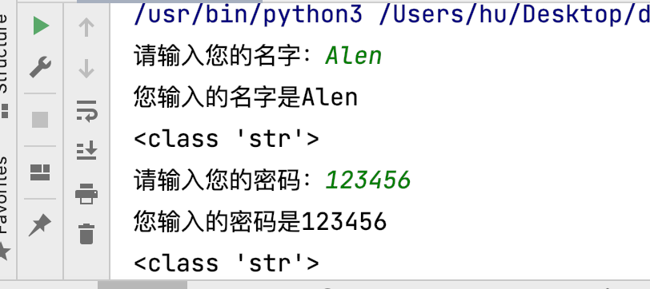
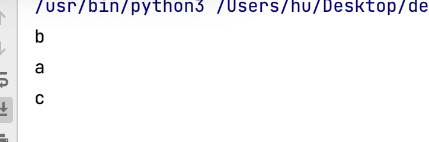
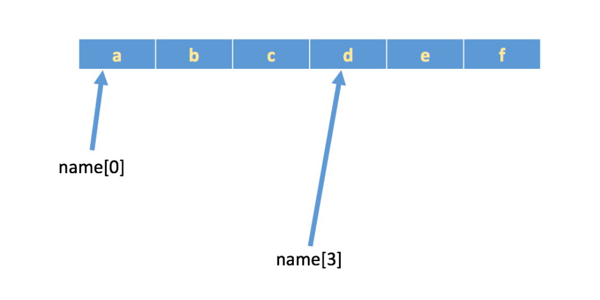
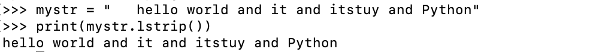
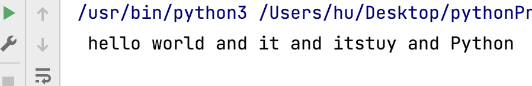
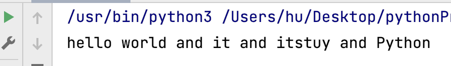
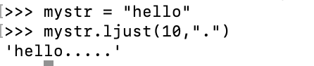
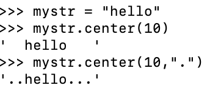
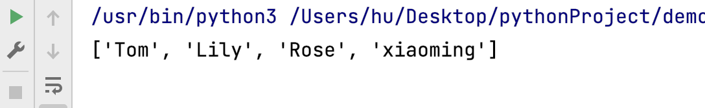

# 课程：字符串

# 目标

- 认识字符串
- 下标
- 切片
- 常用操作方法

# 一. 认识字符串

字符串是 Python 中最常用的数据类型。我们一般使用引号来创建字符串。创建字符串很简单，只要为变量分配一个值即可。

``` python
a = 'hello world'
b = "abcdefg"
print(type(a))
print(type(b))
```

> 注意：控制台显示结果为`<class 'str'>`， 即数据类型为str(字符串)。

## 1.1 字符串特征

- 一对引号字符串

``` python
name1 = 'Tom'
name2 = "Rose"
```


- 三引号字符串

``` python
name3 = ''' Tom '''
name4 = """ Rose """
a = ''' i am Tom, 
        nice to meet you! '''

b = """ i am Rose, 
        nice to meet you! """
```

> 注意：三引号形式的字符串支持换行。

> 思考：如果创建一个字符串` I'm Tom`?

``` python
c = "I'm Tom"
d = 'I\'m Tom'
```

## 1.2 字符串输出

``` python
print('hello world')

name = 'Tom'
print('我的名字是%s' % name)
print(f'我的名字是{name}')
```


## 1.3 字符串输入

在Python中，使用`input()`接收用户输入。

- 代码

``` python
# 输入您的名字
name = input('请输入您的名字：')
# 格式化输出您的名字
print(f'您输入的名字是{name}')
#打印数据类型
print(type(name))
# 输入您的秘密
password = input('请输入您的密码：')
# 您输入的密码是
print(f'您输入的密码是{password}')
# 打印密码类型
print(type(password))
```

- 输出结果




# 二、下标

`“下标”`又叫`“索引”`，就是编号。比如火车座位号，座位号的作用：按照编号快速找到对应的座位。同理，下标的作用即是通过下标快速找到对应的数据。


## 2.1 快速体验

需求：字符串`name = "abcdef"`，取到不同下标对应的数据。

- 代码

``` python
name = "abcdef"
# 打印变量下标0,1,2
print(name[1])
print(name[0])
print(name[2])
```

- 输出结果



> 注意：下标从==0==开始。




# 三、切片

切片是指对操作的对象截取其中一部分的操作。**字符串、列表、元组**都支持切片操作。

## 3.1 语法

``` python
序列[开始位置下标:结束位置下标:步长]
```

> 注意

 	1. 不包含结束位置下标对应的数据， 正负整数均可；
 	2. 步长是选取间隔，正负整数均可，默认步长为1。

## 3.2 体验

``` python
name = "abcdefg"
# 打印开始位置下标为2，结束位置为5，步长为1
print(name[2:5:1])  # cde
# 打印开始位置从2到4的字符串（不包括索引位置5）
print(name[2:5])  # cde
# 打印前5个字符串
print(name[:5])  # abcde
# 从索引为1开始（第二个字符）到末尾的所有字符
print(name[1:])  # bcdefg
# 开头到结尾的所有字符
print(name[:])  # abcdefg
# [::2] 表示从开头到结尾，步长为2
print(name[::2])  # aceg
# 负1表示倒数第一个数据
print(name[:-1])  # abcdef,
# 倒数第四个字符到倒数第二个字符（不包括倒数第一个字符）之间的子字符串
print(name[-4:-1])  # def
# 反转变量 
print(name[::-1])  # gfedcba
```


# 四、常用操作方法

字符串的常用操作方法有查找、修改和判断三大类。

## 4.1 查找

所谓字符串查找方法即是查找子串在字符串中的位置或出现的次数。

- find()：检测某个子串是否包含在这个字符串中，如果在返回这个子串开始的位置下标，否则则返回-1。

1. 语法

``` python
字符串序列.find(子串, 开始位置下标, 结束位置下标)
```

> 注意：开始和结束位置下标可以省略，表示在整个字符串序列中查找。

2. 快速体验

``` python
mystr = "hello world and it and itstudy and Python"
# 找到and字符串索引位置
print(mystr.find('and'))  # 12
# 在索引 15 到 29（不包括30）之间进行查找
print(mystr.find('and', 15, 30))  # 23
# 不存在返回 -1
print(mystr.find('ands'))  # -1
```


- index()：检测某个子串是否包含在这个字符串中，如果在返回这个子串开始的位置下标，否则则报异常。

1. 语法

``` python
字符串序列.index(子串, 开始位置下标, 结束位置下标)
```

> 注意：开始和结束位置下标可以省略，表示在整个字符串序列中查找。

2. 快速体验

``` python
mystr = "hello world and it and itstudy and Python"
# 字符串'and'在mystr中的索引位置
print(mystr.index('and'))  # 12
# 15 到 30 的范围内查找子字符串 'and'
print(mystr.index('and', 15, 30))  # 23

print(mystr.index('ands'))  # 报错
```


- rfind()： 和find()功能相同，但查找方向为==右侧==开始。
- rindex()：和index()功能相同，但查找方向为==右侧==开始。
- count()：返回某个子串在字符串中出现的次数

1. 语法

``` python
字符串序列.count(子串, 开始位置下标, 结束位置下标)
```

> 注意：开始和结束位置下标可以省略，表示在整个字符串序列中查找。

2. 快速体验

``` python
mystr = "hello world and it and itstudy and Python"

print(mystr.count('and'))  # 3
print(mystr.count('ands'))  # 0
print(mystr.count('and', 0, 20))  # 1
```


## 4.2 修改

所谓修改字符串，指的就是通过函数的形式修改字符串中的数据。

- replace()：替换

1. 语法

``` python
字符串序列.replace(旧子串, 新子串, 替换次数)
```

> 注意：替换次数如果查出子串出现次数，则替换次数为该子串出现次数。

2. 快速体验

``` python
mystr = "hello world and it and itstudy and Python"

# 结果：hello world he it he itstudy he Python
print(mystr.replace('and', 'he'))
# 结果：hello world he it he itstudy he Python
print(mystr.replace('and', 'he', 10))
# 结果：hello world and it and itstudy and Python
print(mystr)
```

> 注意：数据按照是否能直接修改分为==可变类型==和==不可变类型==两种。字符串类型的数据修改的时候不能改变原有字符串，属于不能直接修改数据的类型即是不可变类型。


- split()：按照指定字符分割字符串。

1. 语法

``` python
字符串序列.split(分割字符, num)
```

> 注意：num表示的是分割字符出现的次数，即将来返回数据个数为num+1个。

2. 快速体验

``` python
mystr = "hello world and it and itstudy and Python"
# mystr 按照字符串 'and' 进行分割
print(mystr.split('and'))
# 结果：['hello world ', ' it ', ' itstudy ', ' Python']
# 按照'and'分割成最多两部分
print(mystr.split('and', 2))
# 结果：['hello world ', ' it ', ' itstudy and Python']

# 字符串mystr按空格进行分割，并返回一个包含分割后的子字符串的列表
print(mystr.split(' '))
# 结果：['hello', 'world', 'and', 'it', 'and', 'itstudy', 'and', 'Python']
# 以空格为分隔符最多分割成两部分，并返回分割后的结果
print(mystr.split(' ', 2))
# 结果：['hello', 'world', 'and it and itstudy and Python']
```

> 注意：如果分割字符是原有字符串中的子串，分割后则丢失该子串。

- join()：用一个字符或子串合并字符串，即是将多个字符串合并为一个新的字符串。

1. 语法

``` python
字符或子串.join(多字符串组成的序列)
```
    join 方法通常用于将字符串列表（或其他可迭代对象）中的元素连接成 一 个字符串。这在需要将多个字符串连接在一起时非常有用，例如生成  CSV   文件、构建 SQL 查询语句或者构造 HTML 标记等

2. 快速体验

``` python
list1 = ['chuan', 'zhi', 'bo', 'ke']
t1 = ('aa', 'b', 'cc', 'ddd')
# 结果：chuan_zhi_bo_ke
print('_'.join(list1))
# 结果：aa...b...cc...ddd
print('...'.join(t1))
```


- capitalize()：将字符串第一个字符转换成大写。

``` python
mystr = "hello world and it and itstudy and Python"

# 结果：Hello world and it and itstudy and python
print(mystr.capitalize())
```

> 注意：capitalize()函数转换后，只字符串第一个字符大写，其他的字符全都小写。


- title()：将字符串每个单词首字母转换成大写。

``` python
mystr = "hello world and it and itstudy and Python"

# 结果：Hello World And it And itstudy And Python
print(mystr.title())
```


- lower()：将字符串中大写转小写。

``` python
mystr = "hello world and it and itstuy  and Python"

# 结果：hello world and it and itstudy and python
print(mystr.lower())
```


- upper()：将字符串中小写转大写。

``` python
mystr = "hello world and it and itstuy and Python"

# 结果：HELLO WORLD AND IT AND ITSTUDY AND PYTHON
print(mystr.upper())
```


- lstrip()：删除字符串左侧空白字符。




- rstrip()：删除字符串右侧空白字符。




- strip()：删除字符串两侧空白字符。




- ljust()：返回一个原字符串左对齐,并使用指定字符(默认空格)填充至对应长度 的新字符串。

1. 语法

``` python
字符串序列.ljust(长度, 填充字符)
```

2. 输出效果  

    - 用ljust()方法打印长度为10，填充为.的新字符串

    


- rjust()：返回一个原字符串右对齐,并使用指定字符(默认空格)填充至对应长度 的新字符串，语法和ljust()相同。
- center()：返回一个原字符串居中对齐,并使用指定字符(默认空格)填充至对应长度 的新字符串，语法和ljust()相同。

  - 用center()方法打印长度为10，填充为空格的新字符串

    


## 4.3 判断

所谓判断即是判断真假，返回的结果是布尔型数据类型：True 或 False。

- startswith()：检查字符串是否是以指定子串开头，是则返回 True，否则返回 False。如果设置开始和结束位置下标，则在指定范围内检查。

1. 语法

``` python
字符串序列.startswith(子串, 开始位置下标, 结束位置下标)
```

2. 快速体验

``` python
mystr = "hello world and it and itstudy and Python   "

# 结果：True
# 打印以hello开头的字符串
print(mystr.startswith('hello'))

# 结果False
print(mystr.startswith('hello', 5, 20))
```


- endswith()：：检查字符串是否是以指定子串结尾，是则返回 True，否则返回 False。如果设置开始和结束位置下标，则在指定范围内检查。

1. 语法

``` python
字符串序列.endswith(子串, 开始位置下标, 结束位置下标)
```

2. 快速体验

``` python
mystr = "hello world and it and itstudy and Python"


print(mystr.endswith('Python'))
# 结果：True


print(mystr.endswith('python'))
# 结果：False


# 索引范围从2到19的子字符串是否以'Python'结束
print(mystr.endswith('Python', 2, 20))
# 结果：False
```


- isalpha()：如果字符串至少有一个字符并且所有字符都是字母则返回 True, 否则返回 False。

``` python
mystr1 = 'hello'
mystr2 = 'hello12345'

# 结果：True
print(mystr1.isalpha())

# 结果：False
print(mystr2.isalpha())
```


- isdigit()：如果字符串只包含数字则返回 True 否则返回 False。

``` python
mystr1 = 'aaa12345'
mystr2 = '12345'

# 结果： False
print(mystr1.isdigit())

# 结果：False
print(mystr2.isdigit())
```


- isalnum()：如果字符串至少有一个字符并且所有字符都是字母或数字则返 回 True,否则返回 False。

``` python
mystr1 = 'aaa12345'
mystr2 = '12345-'

# 结果：True
print(mystr1.isalnum())

# 结果：False
print(mystr2.isalnum())
```


- isspace()：如果字符串中只包含空白，则返回 True，否则返回 False。

``` python
mystr1 = '1 2 3 4 5'
mystr2 = '     '

# 结果：False
print(mystr1.isspace())

# 结果：True
print(mystr2.isspace())
```


# 五. 总结

- 下标
  - 计算机为数据序列中每个元素分配的从0开始的编号
- 切片

``` python
序列名[开始位置下标:结束位置下标:步长]
```

- 常用操作方法
  - find()
  - index()


# 课程：列表

# 目标

- 列表的应用场景
- 列表的格式
- 列表的常用操作
- 列表的循环遍历
- 列表的嵌套使用

# 一. 列表的应用场景

思考：有一个人的姓名(TOM)怎么书写存储程序？

答：变量。

思考：如果一个班级100位学生，每个人的姓名都要存储，应该如何书写程序？声明100个变量吗？

答：列表即可， 列表一次性可以存储多个数据。

# 二. 列表的格式

``` python
[数据1, 数据2, 数据3, 数据4......]
```

列表可以一次性存储多个数据，且可以为不同数据类型。

# 三. 列表的常用操作

列表的作用是一次性存储多个数据，程序员可以对这些数据进行的操作有：增、删、改、查。

## 3.1 查找

### 3.1.1 下标

``` python
name_list = ['Tom', 'Lily', 'Rose']

print(name_list[0])  # Tom
print(name_list[1])  # Lily
print(name_list[2])  # Rose
```

### 3.1.2 函数

- index()：返回指定数据所在位置的下标 。

1. 语法

``` python
列表序列.index(数据, 开始位置下标, 结束位置下标)
```

2. 快速体验

``` python
name_list = ['Tom', 'Lily', 'Rose']
# 索引0到2之间进行搜索Lily。
print(name_list.index('Lily', 0, 2))  # 1
```


> 注意：如果查找的数据不存在则报错。

- count()：统计指定数据在当前列表中出现的次数。

``` python
name_list = ['Tom', 'Lily', 'Rose']
# 统计Lily出现次数
print(name_list.count('Lily'))  # 1
```

- len()：访问列表长度，即列表中数据的个数。

``` python
name_list = ['Tom', 'Lily', 'Rose']

print(len(name_list))  # 3
```


### 3.1.3 判断是否存在

- in：判断指定数据在某个列表序列，如果在返回True，否则返回False

``` python
name_list = ['Tom', 'Lily', 'Rose']

# 结果：True
print('Lily' in name_list)

# 结果：False
print('Lilys' in name_list)
```


- not in：判断指定数据不在某个列表序列，如果不在返回True，否则返回False

``` python
name_list = ['Tom', 'Lily', 'Rose']

# 结果：False
print('Lily' not in name_list)

# 结果：True
print('Lilys' not in name_list)
```

- 体验案例

需求：查找用户输入的名字是否已经存在。

``` python
# 列表中输入三个名字
name_list = ['Tom', 'Lily', 'Rose']
# 用input方法输入姓名

name = input('请输入您要搜索的名字：')
# 如果姓名再列表里
if name in name_list:
    # 打印输入f+{name}，名字已存在
    print(f'您输入的名字是{name}, 名字已经存在')
else:
    # else 输入f+{name}，名字不存在
    print(f'您输入的名字是{name}, 名字不存在')
```


## 3.2 增加

作用：增加指定数据到列表中。

- append()：列表结尾追加数据。

1. 语法

``` python
列表序列.append(数据)
```

2. 体验

``` python
name_list = ['Tom', 'Lily', 'Rose']

name_list.append('xiaoming')

# 结果：['Tom', 'Lily', 'Rose', 'xiaoming']
print(name_list)
```



> 列表追加数据的时候，直接在原列表里面追加了指定数据，即修改了原列表，故列表为可变类型数据。

3. 注意点

如果append()追加的数据是一个序列，则追加整个序列到列表

``` python
# 赋值包含三个名字的列表
name_list = ['Tom', 'Lily', 'Rose']
# 并添加两个到列表里
name_list.append(['xiaoming', 'xiaohong'])

# 结果：['Tom', 'Lily', 'Rose', ['xiaoming', 'xiaohong']]
print(name_list)
```


- extend()：列表结尾追加数据，如果数据是一个序列，则将这个序列的数据逐一添加到列表。

1. 语法

```python
列表序列.extend(数据)
```

2. 快速体验

   2.1 单个数据

```python
# 赋值包含三个名字的列表
name_list = ['Tom', 'Lily', 'Rose']
# 结尾追加一个名字
name_list.extend('xiaoming')

# 结果：['Tom', 'Lily', 'Rose', 'x', 'i', 'a', 'o', 'm', 'i', 'n', 'g']
print(name_list)
```

​	2.2 序列数据

```python
# 赋值包含三个名字的列表
name_list = ['Tom', 'Lily', 'Rose']
# 结尾追加两个个名字
name_list.extend(['xiaoming', 'xiaohong'])

# 结果：['Tom', 'Lily', 'Rose', 'xiaoming', 'xiaohong']
print(name_list)
```


- insert()：指定位置新增数据。

1. 语法

``` python
列表序列.insert(位置下标, 数据)
```

2. 快速体验

``` python
# 赋值包含三个名字的列表
name_list = ['Tom', 'Lily', 'Rose']
# 下标为1处插入一个姓名
name_list.insert(1, 'xiaoming')

# 结果：['Tom', 'xiaoming', 'Lily', 'Rose']
print(name_list)
```


## 3.3 删除

- del

1. 语法

``` python
del 目标
```

2. 快速体验

   2.1 删除列表

``` python
name_list = ['Tom', 'Lily', 'Rose']

# 结果：报错提示：name 'name_list' is not defined
del name_list
print(name_list)
```

​	2.2 删除指定数据

``` python
# 赋值包含三个名字的列表
name_list = ['Tom', 'Lily', 'Rose']
# 删除下标为0的列表
del name_list[0]

# 结果：['Lily', 'Rose']
print(name_list)
```


- pop()：删除指定下标的数据(默认为最后一个)，并返回该数据。

1. 语法

``` python
列表序列.pop(下标)
```

2. 快速体验

``` python
name_list = ['Tom', 'Lily', 'Rose']

del_name = name_list.pop(1)

# 结果：Lily
print(del_name)

# 结果：['Tom', 'Rose']
print(name_list)
```


- remove()：移除列表中某个数据的第一个匹配项。

1. 语法

``` python
列表序列.remove(数据)
```

2. 快速体验

``` python
name_list = ['Tom', 'Lily', 'Rose']

name_list.remove('Rose')

# 结果：['Tom', 'Lily']
print(name_list)
```


- clear()：清空列表

``` python
name_list = ['Tom', 'Lily', 'Rose']

name_list.clear()
print(name_list) # 结果： []
```


## 3.4 修改

- 修改指定下标数据

``` python
name_list = ['Tom', 'Lily', 'Rose']
# 修改列表下标为0的数据
name_list[0] = 'aaa'

# 结果：['aaa', 'Lily', 'Rose']
print(name_list)
```


- 逆置：reverse()

``` python
num_list = [1, 5, 2, 3, 6, 8]
# 逆序列表
num_list.reverse()
#打印逆序后的列表
# 结果：[8, 6, 3, 2, 5, 1]
print(num_list)
```


- 排序：sort()

1. 语法

``` python
列表序列.sort( key=None, reverse=False)
```

> 注意：reverse表示排序规则，**reverse = True** 降序， **reverse = False** 升序（默认）

2. 快速体验

``` python
num_list = [1, 5, 2, 3, 6, 8]

num_list.sort()

# 结果：[1, 2, 3, 5, 6, 8]
print(num_list)
```


## 3.5 复制

函数：copy()
- copy() 方法用于创建一个对象的浅拷贝，即复制对象的内容而不是对象本身。在 Python 中，通常在以下情况下使用 copy() 方法：

    1.当你需要复制一个列表、字典或其他可变对象时，以便修改副本而不影响原始对象。  

    2.当你需要将可变对象传递给函数或方法，但又不想影响原始对象时，可以先对对象进行拷贝。  

    3.在多线程环境下，使用 copy() 方法可以确保线程之间的数据独立性，避免因为共享对象而导致的并发问题。  

    4.总之，当你需要创建一个原对象的可修改副本，或者需要确保原对象的不可变性时，都可以考虑使用 copy() 方法。

``` python
name_list = ['Tom', 'Lily', 'Rose']

name_li2 = name_list.copy()

# 结果：['Tom', 'Lily', 'Rose']
print(name_li2)
```


# 四. 列表的循环遍历

需求：依次打印列表中的各个数据。

## 4.1 while

- 代码

``` python
name_list = ['Tom', 'Lily', 'Rose']
# 设置计数器为0
i = 0
# 如果计数器小于列表长度，打印列表名[计数器变量]
while i < len(name_list):
    print(name_list[i])
    i += 1
```

- 执行结果


## 4.2 for

- 代码

``` python
name_list = ['Tom', 'Lily', 'Rose']

for i in name_list:
    print(i)
```


- 执行结果


# 五. 列表嵌套

所谓列表嵌套指的就是一个列表里面包含了其他的子列表。

应用场景：要存储班级一、二、三三个班级学生姓名，且每个班级的学生姓名在一个列表。

``` python
# 列表里嵌套3个列表
name_list = [['小明', '小红', '小绿'], ['Tom', 'Lily', 'Rose'], ['张三', '李四', '王五']]
```

> 思考： 如何查找到数据"李四"？

``` python
# 第一步：按下标查找到李四所在的列表，打印第二个列表

print(name_list[2])

# 第二步：从李四所在的列表里面，再按下标找到数据李四
print(name_list[2][1])
```

# 六. 综合应用 -- 随机分配办公室

需求：有三个办公室，8位老师，8位老师随机分配到3个办公室


# 七. 总结

- 列表的格式

``` python
[数据1, 数据2, 数据3]
```

- 常用操作方法
  - index()
  - len()
  - append()
  - pop()
  - remove()
- 列表嵌套

``` python
name_list = [['小明', '小红', '小绿'], ['Tom', 'Lily', 'Rose'], ['张三', '李四', '王五']]
name_list[2][1]
```


# 课程：元组

# 目标

- 元组的应用场景
- 定义元组
- 元组常见操作

# 一.  元组的应用场景

思考：如果想要存储多个数据，但是这些数据是不能修改的数据，怎么做？

答：列表？列表可以一次性存储多个数据，但是列表中的数据允许更改。

``` python
num_list = [10, 20, 30]
num_list[0] = 100
```

==一个元组可以存储多个数据，元组内的数据是不能修改的。==

# 二. 定义元组

元组特点：定义元组使用==小括号==，且==逗号==隔开各个数据，数据可以是不同的数据类型。

``` python
# 多个数据元组
t1 = (10, 20, 30)

# 单个数据元组
t2 = (10,)
```

> 注意：如果定义的元组只有一个数据，那么这个数据后面也好添加逗号，否则数据类型为唯一的这个数据的数据类型

``` python
t2 = (10,)
print(type(t2))  # tuple

t3 = (20)
print(type(t3))  # int

t4 = ('hello')
print(type(t4))  # str
```


# 三. 元组的常见操作

元组数据不支持修改，只支持查找，具体如下：

- 按下标查找数据

``` python
tuple1 = ('aa', 'bb', 'cc', 'bb')
print(tuple1[0])  # aa
```


- index()：查找某个数据，如果数据存在返回对应的下标，否则报错，语法和列表、字符串的index方法相同。

``` python
tuple1 = ('aa', 'bb', 'cc', 'bb')
print(tuple1.index('aa'))  # 0
```


- count()：统计某个数据在当前元组出现的次数。

``` python
tuple1 = ('aa', 'bb', 'cc', 'bb')
print(tuple1.count('bb'))  # 2
```


- len()：统计元组中数据的个数。

``` python
tuple1 = ('aa', 'bb', 'cc', 'bb')
print(len(tuple1))  # 4
```

> 注意：元组内的直接数据如果修改则立即报错

``` python
tuple1 = ('aa', 'bb', 'cc', 'bb')
tuple1[0] = 'aaa'
```

> 但是如果元组里面有列表，修改列表里面的数据则是支持的，故自觉很重要。

``` python
# 打印元组下标为2的内容
tuple2 = (10, 20, ['aa', 'bb', 'cc'], 50, 30)
print(tuple2[2])  # 访问到列表

# 结果：(10, 20, ['aaaaa', 'bb', 'cc'], 50, 30)
tuple2[2][0] = 'aaaaa'
print(tuple2)
```


# 四. 总结

- 定义元组

``` python
t1 = (10, 20, 30)

t2 = (10,)
```

- 常用操作方法
  - index()
  - len()


