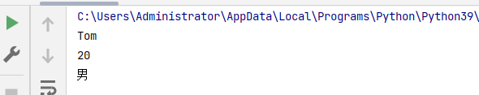

# 课程：字典

# 目标

- 字典的应用场景
- 创建字典的语法
- 字典常见操作
- 字典的循环遍历

# 一. 字典的应用场景

思考1： 如果有多个数据，例如：'Tom', '男', 20，如何快速存储？

答：列表

``` python
list1 = ['Tom', '男', 20]
```

思考2：如何查找到数据'Tom'？

答：查找到下标为0的数据即可。

``` python
list1[0]
```

思考3：如果将来数据顺序发生变化，如下所示，还能用`list1[0]`访问到数据'Tom'吗？。

``` python
list1 = ['男', 20, 'Tom']
```

答：不能，数据'Tom'此时下标为2。

思考4：数据顺序发生变化，每个数据的下标也会随之变化，如何保证数据顺序变化前后能使用同一的标准查找数据呢？

答：字典，字典里面的数据是以==键值对==形式出现，字典数据和数据顺序没有关系，即字典不支持下标，后期无论数据如何变化，只需要按照对应的键的名字查找数据即可。


# 二. 创建字典的语法

字典特点：

- 符号为==大括号==
- 数据为==键值对==形式出现
- 各个键值对之间用==逗号==隔开

- 注意
  - 列表与字典有什么区别
    - 列表主要用于输出，字典主要用于数据查询

- 举例 
  - 用户获取数据时根本不会关心所获取的数据是如何产生的(想象为一个黑盒，里面的所有代码都是未知的),但是如果要返回的数据很多，那么使用列表或字典包装数据是最方便的。如果返回的是一个列表数据，那么只能够进行输出这一种处理，而如果返回的是一个字典，就可以实现数据key的查询处理，所以列表只是比字典少了一个数据 key的查询功能。
``` python


# 有数据字典
dict1 = {'name': 'Tom', 'age': 20, 'gender': '男'}

# 空字典
dict2 = {}

dict3 = dict()
```

> 注意：一般称冒号前面的为键(key)，简称k；冒号后面的为值(value)，简称v。

# 三. 字典常见操作

## 3.1 增

写法：==字典序列[key] = 值==

> 注意：如果key存在则修改这个key对应的值；如果key不存在则新增此键值对。
>

``` python
dict1 = {'name': 'Tom', 'age': 20, 'gender': '男'}

# 给键name赋值
dict1['name'] = 'Rose'
# 结果：{'name': 'Rose', 'age': 20, 'gender': '男'}
print(dict1)
# 插入数据
dict1['id'] = 110

# {'name': 'Rose', 'age': 20, 'gender': '男', 'id': 110}
print(dict1)
```

> 注意：字典为可变类型。


## 3.2 删

- del() / del：删除字典或删除字典中指定键值对。

``` python
dict1 = {'name': 'Tom', 'age': 20, 'gender': '男'}
# 删除字典字段
del dict1['gender']
# 结果：{'name': 'Tom', 'age': 20}
print(dict1)
```


- clear()：清空字典

``` python
dict1 = {'name': 'Tom', 'age': 20, 'gender': '男'}

dict1.clear()
print(dict1)  # {}
```


## 3.3 改

写法：==字典序列[key] = 值==

> 注意：如果key存在则修改这个key对应的值 ；如果key不存在则新增此键值对。

## 3.4 查

### 3.4.1 key值查找

``` python
dict1 = {'name': 'Tom', 'age': 20, 'gender': '男'}
# 打印字典值
print(dict1['name'])  # Tom
# 打印不存在的键
print(dict1['id'])  # 报错
```


字典中的key 不允许重复
字典主要结构是通过key实现对value数据查询，一旦出现key重复的情况，会使用
新的内容替换掉旧的数据
```
dict2 = {'name': 'Tomphosn', 'age': 20, 'gender': '男','name': 'Tomphosn'}
print(dict2)
```


> 如果当前查找的key存在，则返回对应的值；否则则报错。


### 3.4.2 get()

- 语法

``` python
字典序列.get(key, 默认值)
```

> 注意：如果当前查找的key不存在则返回第二个参数(默认值)，如果省略第二个参数，则返回None。

- 快速体验

``` python 
dict1 = {'name': 'Tom', 'age': 20, 'gender': '男'}
# 查找name的值
print(dict1.get('name'))  # Tom
# 获取不存在的键并传入值
print(dict1.get('id', 110))  # 110
# 获取不存在的键省略参数
print(dict1.get('id'))  # None
```

### 3.4.3 keys()

``` python
dict1 = {'name': 'Tom', 'age': 20, 'gender': '男'}
# 打印字典的值
print(dict1.keys())  # dict_keys(['name', 'age', 'gender'])
```


### 3.4.4 values()

``` python
dict1 = {'name': 'Tom', 'age': 20, 'gender': '男'}
#打印字典的键
print(dict1.values())  # dict_values(['Tom', 20, '男'])
```


### 3.4.5 items()

``` python

dict1 = {'name': 'Tom', 'age': 20, 'gender': '男'}
# 循环打印字典键值对 

print(dict1.items())  # dict_items([('name', 'Tom'), ('age', 20), ('gender', '男')])
# <class 'dict_items'> 是 Python 中字典视图对象 (dict_items) 的类型。字典视图对象表示了字典中的键值对的集合，它们在 Python 3 中被引入用于支持字典操作的一种方式
```


# 四. 字典的循环遍历

## 4.1 遍历字典的key

``` python
dict1 = {'name': 'Tom', 'age': 20, 'gender': '男'}
# 变量字典的键
for key in dict1.keys():
    print(key)
```


## 4.2 遍历字典的value

``` python
dict1 = {'name': 'Tom', 'age': 20, 'gender': '男'}
# 变量字典的值
for value in dict1.values():
    print(value)
```




## 4.3 遍历字典的元素

``` python
dict1 = {'name': 'Tom', 'age': 20, 'gender': '男'}
# 遍历字典的元素
for item in dict1.items():
    print(item)
```
items()调用将来
查找当前序列键值队，返回可迭代对象，可迭代
对象内部数据是元组，一个元组是原字典序列的一个键值队，元组
数据1键值队key，元组数据2是键值队value。
# 如果一个对象可以通过循环遍历其元素或者元素的集合，那么它就是一个可迭代对象、(#列表元组字符串字典集合...)


## 4.4 遍历字典的键值对

``` python
dict1 = {'name': 'Tom', 'age': 20, 'gender': '男'}


for key, value in dict1.items():
    print(f'{key} = {value}')
```


# 五. 总结

- 定义字典

``` python
dict1 = {'name': 'Python', 'age': 30}

dict2 = {}

dict3 = dict()
```

- 常见操作
  - 增/改

``` python
字典序列[key] = 值
```

- 查找
  - 字典序列[key]
  - keys()
  - values()
  - items()


# 课程：集合

# 目标

- 创建集合
- 集合数据的特点
- 集合的常见操作


# 一. 创建集合

创建集合使用`{}`或`set()`， 但是如果要创建空集合只能使用`set()`，因为`{}`用来创建空字典。

``` python

s1 = {10, 20, 30, 40, 50}
print(s1)

s2 = {10, 30, 20, 10, 30, 40, 30, 50}
print(s2)

s3 = set('abcdefg')
print(s3)

s4 = set()
print(type(s4))  # set

s5 = {}
print(type(s5))  # dict
```


> 特点：
>
> 1. 集合可以去掉重复数据；
> 2. 集合数据是无序的，故不支持下标


# 二. 集合常见操作方法

## 2.1 增加数据

- add()

``` python
s1 = {10, 20}
s1.add(100)
s1.add(10)
print(s1)  # {100, 10, 20}
```

> 因为集合有去重功能，所以，当向集合内追加的数据是当前集合已有数据的话，则不进行任何操作。

- update(), 追加的数据是序列。

``` python
s1 = {10, 20}
# s1.update(100)  # 报错
# 添加两组数据
s1.update([100, 200])
# 
s1.update('abc')
print(s1)
```


## 2.2 删除数据

- remove()，删除集合中的指定数据，如果数据不存在则报错。

``` python
s1 = {10, 20}

s1.remove(10)
print(s1)

s1.remove(10)  # 报错
print(s1)
```


- discard()，删除集合中的指定数据，如果数据不存在也不会报错。

``` python
s1 = {10, 20}

s1.discard(10)
print(s1)

s1.discard(10)
print(s1)
```
 


- pop()，随机删除集合中的某个数据，并返回这个数据。

``` python
s1 = {10, 20, 30, 40, 50}

del_num = s1.pop()
print(del_num)
print(s1)
```


## 2.3 查找数据

- in：判断数据在集合序列
- not in：判断数据不在集合序列

``` python
s1 = {10, 20, 30, 40, 50}

print(10 in s1)
print(10 not in s1)
```


# 三. 总结

- 创建集合

  - 有数据集合

  ``` python
  s1 = {数据1, 数据2, ...}
  ```

  - 无数据集合

  ``` python
  s1 = set()
  ```

- 常见操作
  - 增加数据
    - add()
    - update()
  - 删除数据
    - remove()
    - discard()


