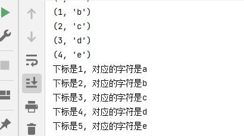

# 课程：公共操作

# 目标

- 运算符
- 公共方法
- 容器类型转换
- os模块


# 一. 运算符

| 运算符 |      描述      |      支持的容器类型      |
| :----: | :------------: | :----------------------: |
|   +    |      合并      |    字符串、列表、元组    |
|   *    |      复制      |    字符串、列表、元组    |
|   in   |  元素是否存在  | 字符串、列表、元组、字典 |
| not in | 元素是否不存在 | 字符串、列表、元组、字典 |

## 1.1 +

``` python
# 1. 字符串 
str1 = 'aa'
str2 = 'bb'
str3 = str1 + str2
print(str3)  # aabb


# 2. 列表 
list1 = [1, 2]
list2 = [10, 20]
list3 = list1 + list2
print(list3)  # [1, 2, 10, 20]

# 3. 元组 
t1 = (1, 2)
t2 = (10, 20)
t3 = t1 + t2
print(t3)  # (10, 20, 100, 200)
```

## 1.2 *

``` python
# 1. 字符串
print('-' * 10)  # ----------

# 2. 列表
list1 = ['hello']
print(list1 * 4)  # ['hello', 'hello', 'hello', 'hello']

# 3. 元组
t1 = ('world',)
print(t1 * 4)  # ('world', 'world', 'world', 'world')
```

## 1.3 in或not in

``` python
# 1. 字符串
print('a' in 'abcd')  # True
print('a' not in 'abcd')  # False

# 2. 列表

list1 = ['a', 'b', 'c', 'd']
print('a' in list1)  # True
print('a' not in list1)  # False

# 3. 元组
t1 = ('a', 'b', 'c', 'd')
print('aa' in t1)  # False
print('aa' not in t1)  # True
```


# 二. 公共方法

| 函数                    | 描述                                                         |
| ----------------------- | ------------------------------------------------------------ |
| len()                   | 计算容器中元素个数                                           |
| del 或 del()            | 删除                                                         |
| max()                   | 返回容器中元素最大值                                         |
| min()                   | 返回容器中元素最小值                                         |
| range(start, end, step) | 生成从start到end的数字，步长为 step，供for循环使用           |
| enumerate()             | 函数用于将一个可遍历的数据对象(如列表、元组或字符串)组合为一个索引序列，同时列出数据和数据下标，一般用在 for 循环当中。 |

## 2.1 len()

``` python
# 1. 字符串
str1 = 'abcdefg'
print(len(str1))  # 7

# 2. 列表
list1 = [10, 20, 30, 40]
print(len(list1))  # 4

# 3. 元组
t1 = (10, 20, 30, 40, 50)
print(len(t1))  # 5

# 4. 集合
s1 = {10, 20, 30}
print(len(s1))  # 3

# 5. 字典
dict1 = {'name': 'Rose', 'age': 18}
print(len(dict1))  # 2
```

## 2.2 del()

``` python
# 1. 字符串
str1 = 'abcdefg'
del str1
print(str1)

# 2. 列表
list1 = [10, 20, 30, 40]
del(list1[0])
print(list1)  # [20, 30, 40]
```

## 2.3 max()

``` python
# 1. 字符串
str1 = 'abcdefg'
print(max(str1))  # g

# 2. 列表
list1 = [10, 20, 30, 40]
print(max(list1))  # 40
```

## 2.4 min()

``` python
# 1. 字符串
str1 = 'abcdefg'
print(min(str1))  # a

# 2. 列表
list1 = [10, 20, 30, 40]
print(min(list1))  # 10
```

## 2.5 range()

``` python
# 1 2 3 4 5 6 7 8 9
for i in range(1, 10, 1):
    print(i)

# 1 3 5 7 9
for i in range(1, 10, 2):
    print(i)

# 0 1 2 3 4 5 6 7 8 9
for i in range(10):
    print(i)
```

> 注意：range()生成的序列不包含end数字。

## 2.6 enumerate()

- 语法

``` python
enumerate(可遍历对象, start=0)
```

> 注意：start参数用来设置遍历数据的下标的起始值，默认为0。

- 快速体验

``` python
list1 = ['a', 'b', 'c', 'd', 'e']

for i in enumerate(list1):
    print(i)

for index, char in enumerate(list1, start=1):
    print(f'下标是{index}, 对应的字符是{char}')
```




# 三. 容器类型转换

## 3.1 tuple()

作用：将某个序列转换成元组

``` python
list1 = [10, 20, 30, 40, 50, 20]
s1 = {100, 200, 300, 400, 500}

print(tuple(list1))
print(tuple(s1))
```


## 3.2 list()

作用：将某个序列转换成列表

``` python
t1 = ('a', 'b', 'c', 'd', 'e')
s1 = {100, 200, 300, 400, 500}

print(list(t1))
print(list(s1))
```


## 3.3 set()

作用：将某个序列转换成集合

``` python
list1 = [10, 20, 30, 40, 50, 20]
t1 = ('a', 'b', 'c', 'd', 'e')

print(set(list1))
print(set(t1))
```

> 注意：

 	1. 集合可以快速完成列表去重
 	2. 集合不支持下标

# 四.os模块
os模块是Python标准库中的一个用于访问操作系统相关功能的模块，os模块提供了一种可移植的使用操作系统功能的方法。使用os模块中提供的接口，可以实现跨平台访问。但是，并不是所有的os模块中的接口在全平台都通用，有些接口的实现是一来特定平台的，比如linux相关的文件权限管理和进程管理

os模块的主要功能：
系统相关、目录及文件操作、执行命令和管理进程
### 4.1系统相关
os模块提供了一些操作系统相关的变量，可以在跨平台的时候提供支持，便于编写移植性高，可用性好的代码。所以在涉及操作系统相关的操作时，请尽量使用本模块提供的方法，而不要使用当前平台特定的用法或格式，否则一旦移植到其他平台，可能会造成难以解决的困扰。  

在使用os模块的时候，如果出现了问题，会抛出OSError异常，表明无效的路径名或文件名，或者路径名(文件名)无法访问，或者当前操作系统不支持该操作。


下面以表格的形式，列举os模块中常用的方法和变量，及其用途解释。个别比较重要的内容会单独举例说明，以后类同。


范例：


# 4.2 文件和目录操作
os模块中包含了一系列文件操作相关的函数，其中有一部分是Linux平台专用方法。Linux是用C写的，底层的libc库和系统调用的接口都是C API，Python的os模块中包括了对这些接口的Python实现，通过Python的os模块，可以调用Linux系统的一些底层功能，进行系统编程。关于Linux的相关方法，内容较为复杂，可根据需要自行查阅官方文档，这里只介绍一些常用的，各平台通用的方法。


下面是一些使用的例子，建议大家都跟着做一遍(其中有一些是错误示范，让你更清楚它的用法)。

# 4.3 执行命令

在早期的Python版本中，通常使用os模块的system或者popen等方法执行操作系统的命令。但是，最近Python官方逐渐弃用了这些命令，而是改用内置的subprocess模块执行操作系统相关命令。由于目前还有很多人仍然在使用os的system方法，在此简要介绍一下。

运行操作系统命令，直接显示结果。但返回值是0或-1，不能获得显示在屏幕上的数据。 command是要执行的命令字符串。

我们尝试在windows下使用python交互式界面运行一下：


如果我们是在windows环境下使用IDLE运行os.system('ipconfig /all')，你会发现命令终端界面一闪而过，根本啥都来不及看。这时候，你最好进入cmd环境使用python命令进入交互式界面才可以看到屏幕上的信息。


# 五. 总结

- 运算符
  - +
  - in / not in
- 公共方法
  - len()
  - del()
  - range()
  - enumerate()
- 数据类型转换
  - tuple()
  - list()
  - set()

os 
  - 系统相关
  - 文件操作
  - 执行命令
