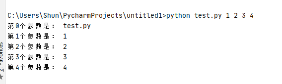

# 课程：推导式

# 目标

- 列表推导式
- 字典推导式
- 集合推导式
- sys

# 一. 列表推导式

作用：用一个表达式创建一个有规律的列表或控制一个有规律列表（普通代码需要三行或五行完成，列表推导式只需一行就完成了，起到简化代码作用）

列表推导式又叫列表生成式。

## 1.1 快速体验     

需求：创建一个0-10的列表。

- while循环实现

``` python
# 1. 准备一个空列表
list1 = []

# 2. 书写循环，依次追加数字到空列表list1中
i = 0
while i < 10:
    list1.append(i)
    i += 1

print(list1)
```

- for循环实现

``` python
list1 = []
for i in range(10):
    list1.append(i)

print(list1)
```

- 列表推导式实现

``` python 
list1 = [i for i in range(10)]
print(list1)
```

## 1.2 带if的列表推导式

需求：创建0-10的偶数列表

- 方法一：range()步长实现

``` python
list1 = [i for i in range(0, 10, 2)]
print(list1)
```

- 方法二：if实现

``` python
list1 = [i for i in range(10) if i % 2 == 0]
print(list1)
```

## 1.3 多个for循环实现列表推导式
'''
### 用嵌套for循环实现需求
- 数据1: 1和2 rang（1,3）
- 数据2: 0 1 2 rang(3)
- list1=[]
- for i in range(1,3):
    for j in range(3):
        # 列表里面追加元组:循环前准备一个空列表,然循环前准备一个空列表，然后这里追加元组数据列表
        list1.append((i,j))
print(list1)

'''


需求：创建列表如下：

``` html
[(1, 0), (1, 1), (1, 2), (2, 0), (2, 1), (2, 2)]
```


- 代码如下：

``` python
list1 = [(i, j) for i in range(1, 3) for j in range(3)]
print(list1)
```


# 二. 字典推导式

思考：如果有如下两个列表：

``` python
list1 = ['name', 'age', 'gender']
list2 = ['Tom', 20, 'man']
```

如何快速合并为一个字典？

答：字典推导式

字典推导式作用：快速合并列表为字典或提取字典中目标数据。

# 2.1 快速体验

1. 创建一个字典：字典key是1-5数字，value是这个数字的2次方。

``` python
dict1 = {i: i**2 for i in range(1, 5)}
print(dict1)  # {1: 1, 2: 4, 3: 9, 4: 16}
```


2. 将两个列表合并为一个字典

``` python 
list1 = ['name', 'age', 'gender']
list2 = ['Tom', 20, 'man']

dict1 = {list1[i]: list2[i] for i in range(len(list1))}
print(dict1)
```

3. 提取字典中目标数据

``` python
counts = {'MBP': 268, 'HP': 125, 'DELL': 201, 'Lenovo': 199, 'acer': 99}

# 需求：提取上述电脑数量大于等于200的字典数据
count1 = {key: value for key, value in counts.items() if value >= 200}
print(count1)  # {'MBP': 268, 'DELL': 201}
```


# 三. 集合推导式

需求：创建一个集合，数据为下方列表的2次方。

``` python
list1 = [1, 1, 2]
```

代码如下：

``` python
list1 = [1, 1, 2]
set1 = {i ** 2 for i in list1}
print(set1)  # {1, 4}
```

> 注意：集合有数据去重功能。

# 4.sys模块

sys模块主要是针对与Python解释器相关的变量和方法，不是主机操作系统。

导入方式：import sys


sys.argv是一个脚本执行参数列表，列表的第一个元素是脚本名称，从第二个元素开始才是真正的参数。

```
# test.py

import sys

for index, arg in enumerate(sys.argv):
    print("第%d个参数是： %s" % (index, arg))

```
运行python test.py 1 2 3 4，结果：



## 4.1.sys.getrefcount(object)

我们都知道Python有自动的垃圾回收机制，让我们不用费力去进行内存管理。那么Python怎么知道一个对象可以被当做垃圾回收呢？Python使用‘引用计数’的方式，追踪每个对象 的引用次数，每对这个对象的一次引用，这个计数就加一，每删除一个该对象的引用，这个计数就减一。当引用为0的时候，就表示没有任何变量指向这个对象，那么就可以回收这个对象，腾出它所占用的内存空间。

sys.getrefcount(object)这个方法可以返回一个对象被引用的次数。注意，这个次数默认从1开始，因为你在使用sys.getrefcount(object)方法的时候就已经引用了它一次（该引用是临时性的，调用结束后，自动解除引用。）。如果不好理解，可以简单地认为它自带被动光环：引用+1。

```
>>> a = "I like Python!"
>>> sys.getrefcount(a)
2
>>> b = a
>>> sys.getrefcount(a)
3
>>> c = a
>>> sys.getrefcount(a)
4
>>> del c
>>> sys.getrefcount(a)
3
>>> del b
>>> sys.getrefcount(a)
2
>>> sys.getrefcount(1)
902
>>> sys.getrefcount("a")
36
>>> sys.getrefcount(True)
581
>>> sys.getrefcount(None)
6918
```
注意实例中的1、"a"、True、None，Python内部环境运行过程中已经引用了它们很多次，None甚至被使用了6918次。

## 4.2.sys.modules

sys.modules保存有当前Python环境中已经导入的模块记录，这是一个全局字典，当Python启动后就加载在内存中。每当导入新的模块，sys.modules将自动记录该模块，当第二次试图再次导入该模块时，Python会先到这个字典中查找是否曾经导入过该模块。是则忽略，否则导入，从而加快了程序运行的速度。同时，它拥有字典的基本方法。例如sys.modules.keys()查看字典的所有键，sys.modules.values()查看字典的所有值，sys.modules['sys']查看sys键对应的值。
```
>>> import sys
>>> sys.modules
{'builtins': <module 'builtins' (built-in)>, 'sys': <module 'sys' (built-in)>, '_frozen_importlib': <module 'importlib._bootstrap' (frozen)>, '_imp': <module '_imp' (built-in)>, '_warnings': <module '_warnings' (built-in)>, '_thread': 
.......截取部分
>>> sys.modules.keys()
dict_keys(['builtins', 'sys', '_frozen_importlib', '_imp', '_warnings', '_thread', '_weakref', '_frozen_importlib_external', '_io', 'marshal', 'nt', 'winreg', 'zipimport', 'encodings', 'codecs', '_codecs', 'encodings.aliases', 
...截取部分
>>> sys.modules.values()
dict_values([<module 'builtins' (built-in)>, <module 'sys' (built-in)>, <module 'importlib._bootstrap' (frozen)>, <module '_imp' (built-in)>, <module '_warnings' (built-in)>, <module '_thread' (built-in)>, <module '_weakref' module 'urllib.parse' from 'C:\\Python36\\lib\\urllib\\parse.py'>])
.......截取部分
>>> sys.modules['sys']
<module 'sys' (built-in)>
```
## 4.3 sys.path
path是一个目录列表，供Python从中查找模块。在Python启动时，sys.path根据内建规则和PYTHONPATH变量进行初始化。sys.path的第一个元素通常是个空字符串，表示当前目录。

## 4.4 sys.platform
获取当前执行环境的平台名称，不同的平台返回值如下表所示：

# 四. 总结

- 推导式的作用：简化代码
- 推导式写法

``` python
# 列表推导式
[xx for xx in range()]

# 字典推导式
{xx1: xx2 for ... in ...}

# 集合推导式
{xx for xx in ...}
```

- sys
     <!-- 返回一个对象被引用的次数 -->
    - sys.getrefcount(object)
    <!-- sys.modules保存有当前Python环境中已经导入的模块记录 -->
    - sys.modules

    <!-- 返回一个对象被引用的次数 -->
    - sys.getrefcount(object)
