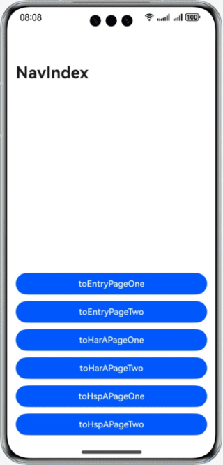

# 基于系统路由表实现页面跳转

### 介绍

本项目提供系统路由的验证，运用系统路由表的方式，跳转到模块(HSP/HAR)的页面，可以不用配置不同跳转模块间的依赖。当发生页面跳转时，未跳转页面不会加载，已经加载过的页面不会再次加载。 解决了不同模块依赖耦合的问题，以及首页加载时间长的问题。

### 效果预览



使用说明

1. 主页会提供一个NavIndex的导航页，点击按钮会跳转到不同的来自HAR和HSP包的页面

2. 每个HAR和HSP包的页面也存在跳转到别的页面的按钮

### 工程目录

```
├──entry/src/main/ets/
│  ├──common
│  │  └──utils
│  │     └──Logger.ets                          // 日志打印封装
│  ├──entryability
│  │  └──EntryAbility.ets                       // 程序入口  
│  └──pages
│     ├──EntryPageOne.ets                       // 页面1
│     ├──EntryPageTwo.ets                       // 页面2
│     └──Index.ets                              // 界面实现
├──entry/src/main/resources                     // 应用资源目录
├──harA
├──harB
├──hspA
└──hspB
```

### 具体实现

1.创建hapA harA hspA hspB

2.在跳转目标模块的配置文件module.json5添加路由表配置

3.添加完路由配置文件地址后，需要在工程resources/base/profile中创建route_map.json文件

4.在跳转目标页面中，需要配置入口Builder函数，函数名称需要和router_map.json配置文件中的buildFunction保持一致。

5.应用通过调用pushDestinationByName等方式，可以获取跳转目标页面的错误信息。

### 相关权限

不涉及

### 约束与限制

1. 本示例仅支持标准系统上运行，支持设备：华为手机。

2. HarmonyOS系统：HarmonyOS 5.0.0 Release及以上。

3. DevEco Studio版本：DevEco Studio 5.0.0 Release及以上。

4. HarmonyOS SDK版本：HarmonyOS 5.0.0 Release SDK及以上。

### 注意

运行时需设置引用所有HSP模块。设置运行后，点击Run > entry来启动应用/服务的编译构建。
